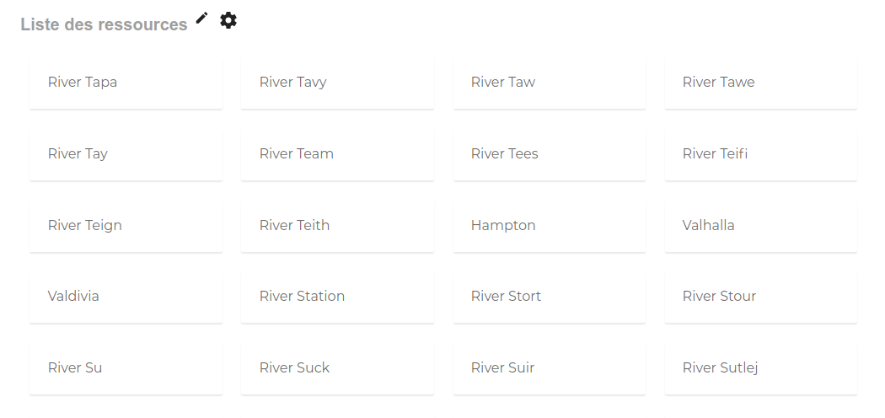

# Resources Grid

La grille de ressource affiche une liste \(ou une grille, en fonction de la largeur de la fenêtre du navigateur, et du paramètre `width`\) de ressources avec des liens vers ces ressources. Les caractéristiques affichées de chaque ressource sont: le _Title_ et la _Description_ de la ressource \(à renseigner dans la case _Syndication_ de la configuration des champs en question\).

 Dans l'exemple ci-dessus, les ressources n'ont pas de _Description_ sélectionnée \(c'est optionnel\), mais ont un _Title_.

## Paramètres

### Maximum fields number

Ce paramètre donne le nombre de ressources à afficher par défaut. S'il y a 11 ressources, on peut le fixer à 11, ça évite d'avoir à cliquer sur le bouton _More_ qui s'affiche quand il y a plus de ce ressources que ce paramètre.

Après avoir cliqué sur More, 10 ressources de plus sont affichées. 

## Value

La valeur à donner à ce champ dont la couverture est le Dataset est `/api/run/syndication`.

> **Remarque** : n'oubliez pas de déclarer cette routine [dans le fichier de configuration](../../../configuration/routines/).

