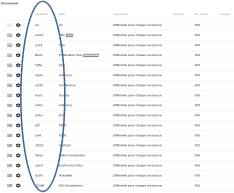

# routines

Les routines de LODEX sont des scripts, fournis par LODEX, ou stockables n'importe où sur le web, qui peuvent effectuer des agrégations, des calculs, des reformatages et renvoyer des données sous une forme utilisable \(souvent par un [format](../../administration/modele/format/) de type graphique\).

Les routines sont appelées via l'API web de LODEX, et s'appliquent à un champ \(ou plus\). Quand on connaît le nom de la routine à utiliser \(disons `routine-exemple`\), il suffit de l'ajouter derrière `/api/run/` pour obtenir la _route_ à utiliser \(comme valeur de champ pour un format graphique\): `/api/run/routine-exemple`.

## Déclaration dans la configuration

Pour qu'une routine soit utilisable dans LODEX via son API, il est nécessaire de la déclarer dans sa configuration.

Le nom de la routine doit être exactement le même que celui du fichier en ligne \(avec l'extension `.ini`\).

Exemple:

```javascript
  "pluginsURL" : "https://raw.githubusercontent.com/Inist-CNRS/lodex-extented/master/",
  "routines": [
    "hello-world",
    "all-fields",
    "all-resources",
    "all-documents",
    "syndication",
    "count-by-fields",
    "count-all",
    "distinct-by",
    "pairing-with",
    "graph-by",
    "distinct-ISO3166-1-alpha3-from",
    "distinct-ISO3166-1-alpha2-from"
  ],
```

Le fichier hello-world.ini doit exister à l'adresse [https://raw.githubusercontent.com/Inist-CNRS/lodex-extented/master/routines/hello-world.ini](https://raw.githubusercontent.com/Inist-CNRS/lodex-extented/master/routines/hello-world.ini).

## Routines fournies par LODEX

* [all-documents](alldocuments.md)
* [all-fields](allfields.md)
* [all-resources](allresources.md)
* [count-all](countall.md)
* [count-by-fields](countbyfields.md)
* [distinct-by](distinctby.md)
* [syndication](syndication.md)

Pour pouvoir utiliser une des routines de LODEX, il faut qu'elle soit déclarée dans le champ `routines` du fichier de configuration.

Le résultat d'une routine peut être visualisé à partir d'une URL de la forme:

[http://**url-instance**/api/run/**routine**/**identifiant**](http://url-instance/api/run/routine/identifiant)

où

* **url-instance** est l'URL de l'instance
* **routine** est la routine utilisée
* **identifiant** est le code attributé par LODEX au champ représenté \(voir dans le modèle\)

Dans les formats, elles doivent être déclarées dans `Value` \(Valeur\) selon:

/api/run/**routine**/**identifiant**

où

* **routine** est la routine utilisée
* **identifiant** est le code attribué par LODEX au champ représenté \(voir dans le modèle\)

**Exemple** : pour le site exemple « Changement climatique - Recherche française \(avec laboratoires CNRS\) - 2010-2015 » à l'adresse suivante [http://lodex-cop21.dpi.inist.fr](http://lodex-cop21.dpi.inist.fr), les identifiants du modèle:



## Routines externes

Il est possible d'écrire ses propres routines, et de les rendre accessibles à LODEX sans avoir le droit de modifier LODEX. Il suffit pour cela de mettre les fichiers sur le web, et de renseigner LODEX sur leur emplacement, en utilisant le champ `pluginsURL` du fichier de configuration.

Mettez vos fichiers de routines en ligne, dans un répertoire nommé `routines`, au format texte \(avec l'extension `.ini`\).

**Exemple**: `"pluginsURL": "https://raw.githubusercontent.com/Inist-CNRS/lodex-extented/master/"` qui fournit les routines suivantes :

* [distinct-ISO3166-1-alpha2-from](distinctiso31661alpha2from.md)
* [distinct-ISO3166-1-alpha3-from](distinctiso31661alpha3from.md)
* [distinct-alpha-2-alpha3-from](distinctalpha2alpha3from.md)
* [distinct-alpha-3-alpha2-from](distinctalpha3alpha2from.md)
* [graph-by](graphby.md)
* [pairing-with](pairingwith.md)

## Format des routines

Les routines sont stockées dans des fichiers dont l'extension est `.ini`.

Un commentaire est une ligne commençant par `#`.

Le fichier est séparé en sections dont le nom est donné entre crochets.

### Entête

Chaque fichier de routine commence par un entête comprenant les champs suivant:

* extension \(valeurs possibles: `js`, ?\)
* mimeType \(valeurs possibles: `application/json`, ?\)
* type \(valeurs possibles: `file`, ?\)
* label \(optionnel, explication sur l'objet de la routine\)

### Section \[use\]

Dans cette section, on déclare les plugins qu'on va utiliser dans la routine.

Pour trouver une liste des plugins disponibles, voir la page [https://www.npmjs.com/browse/keyword/ezs](https://www.npmjs.com/browse/keyword/ezs).

Sur cette page, chaque plugin commence par `ezs-`, par exemple `ezs-basics` est le plugin connu par LODEX sous le nom de `basics`, qui fournit une série d'instructions:

* BUFObject
* CSVObject
* CSVParse
* CSVString
* JSONParse
* JSONString
* OBJCount
* OBJFlatten
* OBJStandardize
* SKOSObject
* TXTConcat
* TXTObject
* TXTParse
* URLFetch
* XMLParse

### Instructions disponibles

D'ailleurs, LODEX fournit sa propre série d'instructions:

* filterVersions
* filterContributions
* useFieldNames
* linkDataset
* JSONLDCompacter
* JSONLDString
* JSONLDObject
* extractIstexQuery
* scroll
* convertJsonLdToNquads
* convertToExtendedJsonLd
* convertToAtom
* convertToSitemap
* LodexContext
* LodexConfig
* LodexParseQuery
* LodexRunQuery
* LodexReduceQuery
* LodexSetField
* LodexOutput

### Section \[assign\]

On peut ajouter des sections \[assign\] n'importe où dans le fichier de routine, elles servent à affecter une valeur à une variable.

Exemple:

```javascript
[assign]
path = total
value = get('total')
```

Cette section affecte la valeur du champ `total` à la variable du même nom.

